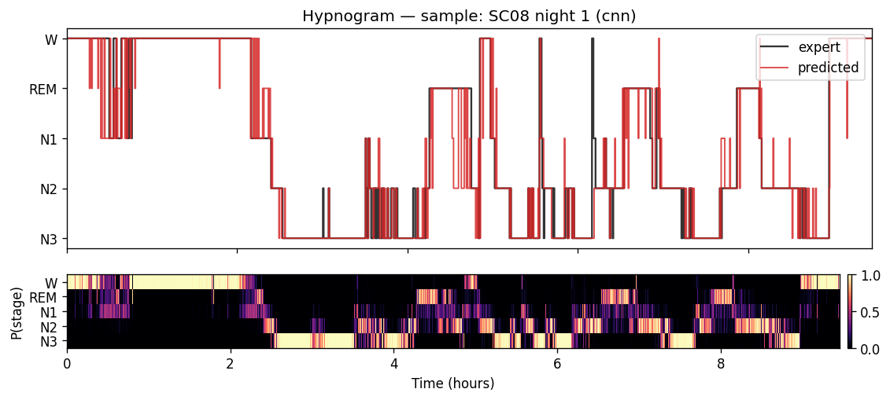

# eeg-sleep-stager

Distributed EEG feature extraction with **PySpark**, feeding a **Keras 1-D CNN**
that classifies 30-second sleep epochs into the five AASM stages (W, N1, N2, N3,
REM) on the open **Sleep-EDF Expanded** corpus — with **subject-wise validation**
so the reported numbers are honest.

> - distributed data engineering (PySpark ETL over ~150 multi-hour polysomnography recordings)
> - deep learning on raw physiological signal, evaluated without cross-subject leakage through subject-wise splitting: no epoch from a subject in the test set ever appears in training (epoch-level random splits leak physiology across the split and inflate accuracy by 10+ points)
> - the honest numbers are reported (macro-F1 and Cohen's κ, the standard sleep-staging metric)

**Live demo (Hugging Face Spaces):** _not yet deployed_ <!-- https://huggingface.co/spaces/<user>/<space> -->
&nbsp;·&nbsp; **Deep dives:** [the science & history](storyline.md) · [the CNN](cnn.md) · [the metrics](metrics.md)

## Introduction

As part of my internship at the Sleep & Memory Lab at the Donders Centre for
Cognitive Neuroimaging, under the supervision of Prof. Martin Dresler, I contributed
to research projects on human sleep. As a junior researcher, I was often handed
[polysomnography (PSG)](storyline.md#3-polysomnography-what-is-actually-recorded)
recordings to score — the kind of meticulous, boring job nobody wants to do.
Nevertheless, I always found excitement in sleep staging: it is craftsmanship at the
intersection between science and art. The task is simple: scroll through whole nights
of PSG, in 30-second epochs, and mark each epoch as one of the sleep stages based on
the presence of hallmark signals — *sleep spindles*, *k-complexes*, and the
prevalence of spectral [*delta power*](storyline.md#1-what-sleep-staging-is). Over
time your feeling for the stages grows to the point where you anticipate that in an
epoch or two the stage will change. The lab did the scoring in FieldTrip, a Matlab
toolbox developed at the Donders that became one of the standards for M/EEG analysis
in Matlab. It offered automated assistance — displaying the relative spectral band
power, marking the signature sleep-stage signals, and pre-labelling each epoch so the
scorer only had to accept, reject, or correct the label. I believe the automated
staging was done with a Hidden Markov Model (HMM), the standard at the time, which was
already pretty decent. After gaining some confidence, though, I often turned the
assistant off and scored each epoch manually, feeling like Luke Skywalker closing his
eyes to use the Force for the decisive shot at the Death Star. Another fun aspect was
comparing my staging with the automated one, or with those of colleagues.
*Inter-Rater Agreement (IRA)* was normally pretty high for *Slow-Wave Sleep (SWS)* and
lower for the other stages ("Is the subject awake? Or is it REM? Or could it be N1?").
I always felt that raters' standards and preferences had a big impact on the scoring,
particularly for the wake-to-sleep transition (N1), and I wondered whether it made
sense at all to keep the N1 label. Historically,
[an entire stage — Stage 4 — was removed, collapsed into N3](storyline.md#24-the-aasm-revision-2007),
precisely because the 3-vs-4 boundary had poor inter-rater reliability. This is what
motivates the project: if, in the age of neural networks, IRA is still low for N1,
should we keep using it — or treat it as ontologically ephemeral and focus our
attention on SWS and REM? To answer, I built and trained a *convolutional neural
network (CNN)* ([cnn.md](cnn.md)) and compared its *macro-F1* with that of a features
baseline. The intuition: plain accuracy will be high simply because the easy,
prevalent N2 and N3 stages dominate. [Macro-F1](metrics.md), by contrast, is the
unweighted mean of the per-stage F1 scores (each itself the harmonic mean of that
stage's precision and recall), so it is a more reliable indicator of whether the
stages can actually be told apart; the [per-stage F1](metrics.md) then tells us which
stages are the problematic ones.

Two side notes before the project description:

1. Differently from, e.g., the MNIST dataset, ground truth here is actually absent:
   there is no guarantee the expert got every label right, assuming it is even possible
   to define right or wrong in this space. The five stages are a definitional/clinical
   convention built on scoring rules; the scheme was never designed to be "ontological
   truth", or "five compact clusters in EEG feature space".
2. Only 1-channel EEG was analyzed here, although PSG includes a second EEG channel as
   well as [EOG and EMG](storyline.md#3-polysomnography-what-is-actually-recorded). The
   latter two are especially important for identifying REM sleep, so REM F1 may
   especially suffer from this analysis choice.

## What it does

A single command line takes the project end to end: **`ingest`** downloads the public
recordings, a **PySpark ETL** (`etl`) cuts every night into 30 s epochs, aligns them
with the expert hypnogram, extracts spectral/Hjorth features, and writes a Parquet
epoch store; **`split`** makes a seeded, subject-disjoint train/val/test partition;
**`train`** fits a 1-D CNN on the raw signal and a GradientBoosting baseline on the
features; and **`evaluate`** reports honest held-out metrics. A **[Gradio web
demo](#web-demo)** then wraps the trained model for interactive staging in the browser.

- **[storyline.md](storyline.md)** — what sleep staging is, the history (Berger → R&K →
  AASM), what polysomnography records, and why subject-wise evaluation matters.
- **[cnn.md](cnn.md)** — the 1-D CNN layer by layer: architecture, training, the
  baseline it is measured against, and the serve-time invariant.
- **[metrics.md](metrics.md)** — accuracy, macro-F1, Cohen's κ, per-stage F1, and the
  confusion matrix, defined and read on this project's numbers.

## Architecture

```
                    physionet.org (public, open-access)
                              │  (wget/rsync, no auth)
                              ▼
   data/raw/  SC4xxxE0-PSG.edf  +  SC4xxxEC-Hypnogram.edf   (~153 recordings)
                              │
                    [ ingest ]  build manifest.csv (one row per recording)
                              ▼
   ┌─────────────────────────────────────────────────────────────┐
   │  PySpark ETL  (spark.read manifest → repartition by subject) │
   │    mapPartitions → per recording:                            │
   │      • MNE reads EDF, picks channel 'EEG Fpz-Cz' @100Hz      │
   │      • segment into 30s epochs (3000 samples)                │
   │      • read hypnogram annotations, map to 5 AASM classes     │
   │      • drop '?'/Movement epochs; trim wake padding           │
   │      • per epoch: compute features (band powers, Hjorth, …)  │
   │      • emit Row(subject, night, epoch_idx, stage,            │
   │                 signal[3000], feat_bandpower_delta, …)       │
   └─────────────────────────────────────────────────────────────┘
                              │  write Parquet, partitioned by subject
                              ▼
        data/processed/epochs.parquet/   (subject=SCxx/…)
                              │
                    [ split ]  subject-wise, seeded → splits.json
                              ▼
        ┌───────────────────────────┬──────────────────────────┐
        ▼                           ▼                          ▼
   [ train --model cnn ]     [ train --model baseline ]   (test held out)
   1-D CNN on raw signal     GBM on engineered features
        │                           │
        └────────────┬──────────────┘
                     ▼
              [ evaluate ]  macro-F1, Cohen's κ, confusion matrix,
                            hypnogram overlay PNG  → reports/
```

Inference for the web demo does **not** use Spark: `inference.py` reads one EDF with
MNE, reproduces the exact ETL preprocessing in plain NumPy, and runs the saved model.

## Results

Full **Sleep-EDF Cassette** corpus: 78 subjects, subject-wise split (54 train /
12 val / 12 test), evaluated on the **12 held-out test subjects** (31,388 epochs).
See [metrics.md](metrics.md) for how each metric is defined and read.

| Model | Accuracy | Macro-F1 | Cohen's κ | Test subjects |
|---|---|---|---|---|
| CNN (raw signal) | **0.776** | **0.714** | **0.694** | 12 |
| Baseline (features + GBM) | 0.677 | 0.617 | 0.571 | 12 |

The **CNN overtakes the baseline on every metric and every stage** — the payoff
the project was set up to test. Its biggest wins are REM (F1 0.70 vs 0.50) and W
(0.94 vs 0.84), stages where learned morphology beats hand-crafted band-power /
Hjorth features. Cohen's κ = 0.694 is **substantial** agreement, near the human
inter-scorer band (κ ≈ 0.76–0.80) and in the realistic range for a plain
single-channel Fpz-Cz CNN. **N1 is the weakest stage** for both (F1 0.44 / 0.39) —
rare (~13% of epochs here) and intrinsically ambiguous, as it is across the
sleep-staging literature. Per-stage F1, the confusion matrix, and the worked
read-through are in [metrics.md](metrics.md).

## Web demo

An interactive **Gradio** app ([`app.py`](app.py)) wraps the trained model: upload a
full-night `*-PSG.edf` — or click **Load sample night** — and get the CNN's staging
back as a hypnogram, a stage summary, and a downloadable per-epoch CSV. Add the
matching `*-Hypnogram.edf` for an expert-vs-predicted overlay and honest metrics. A
radio switches between the 1-D CNN and the GBM baseline.



*Bundled sample (SC08 night 1, a held-out **test** subject): predicted (red) vs
expert (black) hypnogram, with the model's per-epoch P(stage) below — bright where
confident (the W and N3 blocks), hesitant through the N1 transitions.*

It reuses the exact training preprocessing (per-recording z-score, 30 s epochs,
Fpz-Cz @ 100 Hz — the [serve-time invariant](cnn.md#7-serve-time-consistency-the-one-invariant))
and **never touches Spark** — inference is plain MNE/NumPy/TF. It's a **research demo,
not a medical device**.

Run it locally (serve-only deps, no Spark):

```bash
python -m venv .venv-app && .venv-app/Scripts/python.exe -m pip install -r requirements.txt
python scripts/make_sample.py            # build the bundled sample from the epoch store
.venv-app/Scripts/python.exe app.py      # serves on http://127.0.0.1:7860
```

Or `pip install -e ".[app]" && python app.py` inside the pipeline env. To deploy to
**Hugging Face Spaces**, follow [docs/huggingface-space.md](docs/huggingface-space.md)
(Python **3.11**, pinned gradio stack, Git-LFS for the model + sample); a ready-to-paste
Space landing page is in [docs/space-README.md](docs/space-README.md).

<!-- Live demo: https://huggingface.co/spaces/<user>/<space>  (add once deployed) -->

## Quickstart

> **Python 3.11 is required.** The stack pins `tensorflow==2.15.0`, which has no
> wheels for 3.12+. On Windows, install it with the `py` launcher
> (`py install 3.11`) and create the venv with `py -3.11 -m venv .venv`; on
> Linux/macOS use `python3.11`. Newer interpreters will fail at `pip install`.

```bash
py -3.11 -m venv .venv                               # Linux/macOS: python3.11 -m venv .venv
source .venv/bin/activate                            # Windows: .venv\Scripts\activate
pip install -e ".[dev]"
pytest                                               # green
eeg-sleep-stager --help
eeg-sleep-stager --version
```

## Pipeline (CLI)

```bash
eeg-sleep-stager ingest   --limit 6                  # download subset -> manifest.csv
eeg-sleep-stager etl      --master "local[*]"        # Spark ETL -> epochs.parquet
eeg-sleep-stager split    --seed 42                  # subject-wise split -> splits.json
eeg-sleep-stager train    --model cnn                # 1-D CNN
eeg-sleep-stager train    --model baseline           # GradientBoosting on features
eeg-sleep-stager evaluate --model cnn                # metrics + plots -> reports/
make demo                                            # ingest -> evaluate on 6 subjects
```

## Data

Sleep-EDF Expanded v1.0.0, *Sleep Cassette* subset —
<https://physionet.org/content/sleep-edfx/1.0.0/> — **open access, no login** (78
subjects, 153 recordings). Each subject-night is a `*-PSG.edf` (signals) + a
`*-Hypnogram.edf` (expert scoring). EEG is 100 Hz; 30 s epochs → 3000 samples. The
history and clinical background are in [storyline.md](storyline.md). To pull the whole
set manually:

```bash
wget -r -N -c -np https://physionet.org/files/sleep-edfx/1.0.0/sleep-cassette/
```

### Data model

The hypnogram annotations map to the AASM 5-class label space (Stages 3 and 4 are
merged into N3; `?`/Movement are dropped):

| Hypnogram annotation | Class | id |
|---|---|---|
| Sleep stage W | W | 0 |
| Sleep stage 1 | N1 | 1 |
| Sleep stage 2 | N2 | 2 |
| Sleep stage 3, Sleep stage 4 | N3 | 3 |
| Sleep stage R | REM | 4 |
| Sleep stage ?, Movement time | *dropped* | — |

The ETL writes `data/processed/epochs.parquet` (partitioned by `subject_id`), one row
per 30 s epoch: `subject_id, night, epoch_idx, stage`, the raw `signal` (length-3000
µV array, z-scored per recording), and ten engineered features (`feat_bp_{delta,
theta, alpha, sigma, beta}`, `feat_spec_entropy`, `feat_hjorth_{activity, mobility,
complexity}`, `feat_rms`). The seeded subject-wise partition is written to
`splits.json` as `{ "seed": 42, "train": [...], "val": [...], "test": [...] }`.

## Configuration

All run parameters live in [`config.yaml`](config.yaml) (paths, EEG channel, band
edges, split fractions, model hyperparameters) and are validated by
`eeg_sleep_stager.config.load_config`. Machine-local paths and Spark/Java knobs go in
`.env` (see [`.env.example`](.env.example)); the dataset is open access, so there are
no secrets. Useful flags: `etl --channel "EEG Fpz-Cz" --epoch-sec 30`,
`train --batch-size 128 --lr 1e-3 --class-weights auto`, `ingest --limit N`.

## Tech stack

| Concern | Choice | Why |
|---|---|---|
| Language | Python 3.11 | MNE / Spark / TF all support it; pinned because TF 2.15 / SciPy 1.11 have no wheels for 3.12+. |
| Distributed ETL | **PySpark 3.5** (local mode by default) | The epoch-extraction + feature job is per-recording parallel; the same code scales from a laptop subset to a cluster. |
| EDF I/O | **MNE-Python 1.6** | De-facto standard for reading EDF/EDF+ and hypnogram annotations. Called inside Spark workers. |
| Signal features | SciPy 1.11 (`scipy.signal.welch`), NumPy | Band powers, spectral entropy, Hjorth parameters. |
| Intermediate store | **Parquet** (partitioned by subject) | Columnar, Spark-native; keeps raw-epoch arrays + features together. |
| Deep learning | **TensorFlow 2.15 / Keras** | 1-D CNN is a natural fit for the raw epoch. |
| Baseline / metrics | scikit-learn 1.4 | GradientBoosting baseline; `f1_score(average='macro')`, `cohen_kappa_score`, confusion matrix. |
| Web demo | **Gradio 4.44** | Browser UI over the trained model; deployable to Hugging Face Spaces. |
| CLI | **Typer** | Clean subcommands (`ingest`, `etl`, `split`, `train`, `evaluate`). |
| Config | Pydantic 2 + a single `config.yaml` | Typed, validated run config. |
| Tests | pytest 8 | Unit tests on the pure feature/label/inference functions with synthetic signals. |

## Code layout

```
src/eeg_sleep_stager/
  config.py     # Pydantic config + load_config(path) from config.yaml
  ingest.py     # download helper + build_manifest() -> manifest.csv
  labels.py     # ANNOTATION_MAP; map_annotation(str) -> int|None   (pure, tested)
  features.py   # band_powers(), hjorth(), spectral_entropy()       (pure, tested)
  etl.py        # Spark job: manifest -> epochs.parquet (process_recording per partition)
  split.py      # subject-wise seeded split -> splits.json
  datasets.py   # Parquet -> tf.data / numpy arrays for a split
  models.py     # build_cnn1d(), build_baseline()  (Keras + sklearn)
  train.py      # fit loop, class weights, checkpointing -> models/
  evaluate.py   # metrics, confusion matrix, hypnogram overlay -> reports/
  inference.py  # serve-time: EDF -> epochs -> predictions (NO Spark); used by app.py
  cli.py        # Typer app wiring the subcommands
app.py          # Gradio web demo (imports inference.py)
scripts/
  make_sample.py  # one held-out test night from parquet -> app_assets/sample_night.npz
```

The pure leaf functions (`labels.py`, `features.py`) and the serve-time preprocessing
(`inference.py`) are unit-tested with synthetic signals — they are what the Spark
workers and the demo rely on, so keeping them pure and tested is the whole quality
story.

## Requirements

- **Python 3.11** (exactly — see the note in *Quickstart*; 3.12+ has no TensorFlow 2.15 wheels).
- **Java 11+** (Temurin) — required by Spark 3.5, for the ETL only (not the web demo).

### Windows + Spark setup

Spark is a Java engine, so it needs a JDK, and on Windows it also needs the
`winutils.exe` Hadoop shim. One-time setup (CI and reference runs assume Linux/WSL and
need none of this):

```powershell
# 1. JDK 11
winget install EclipseAdoptium.Temurin.11.JDK

# 2. winutils + hadoop.dll matching Spark's bundled Hadoop (3.3.x)
#    from github.com/cdarlint/winutils, placed in C:\hadoop\bin
#    (third-party unsigned binaries — review the source before trusting them)

# 3. environment variables (User scope)
setx JAVA_HOME   "C:\Program Files\Eclipse Adoptium\jdk-11.0.32.9-hotspot"
setx HADOOP_HOME "C:\hadoop"
#    add %HADOOP_HOME%\bin to PATH
```

`etl` sets `PYSPARK_PYTHON` to the active interpreter automatically; without it,
PySpark on Windows spawns a mismatched Python and workers die with a socket reset.

## Development

```bash
pip install -e ".[dev]"
pytest
ruff check src tests
```

## Scope & limitations

**In scope:** the public Sleep Cassette subset; a PySpark ETL to a partitioned epoch
store; subject-wise splits; a 1-D CNN and a features baseline; honest evaluation; and
a full-night batch web demo.

**Out of scope:** beating the published state of the art (DeepSleepNet, U-Sleep);
multi-channel / multi-modal fusion (EOG, EMG); real-time or streaming inference; and
any clinical use. This is a demonstration, not a medical device. What would most move
the numbers is discussed in [cnn.md §8](cnn.md#8-limitations-and-what-would-move-the-numbers).

## License

MIT.
